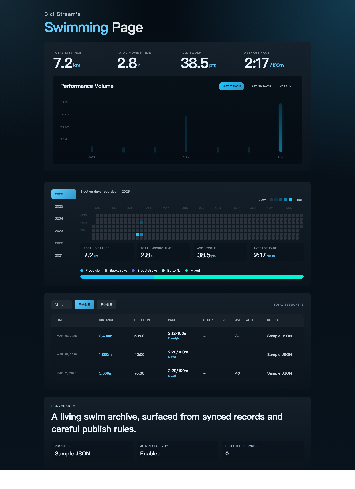

# Deep Water Swimming Page

Deep Water Swimming Page is a swim-native personal performance homepage built around a small publish pipeline:

```text
raw swim sessions -> canonical private data -> public generated data -> homepage
```

The goal is to make a swimmer's training archive feel deliberate and publishable, instead of looking like a generic fitness export or admin dashboard.



## What Ships Today

- Vite + React + TypeScript front end
- `build-data` pipeline that normalizes source sessions into private and public artifacts
- a publish-friendly homepage with summary metrics, yearly consistency heatmap, stroke mix, and activity archive
- sample config and sample swim sessions so the project runs on first clone
- a design system in [DESIGN.md](./DESIGN.md) that defines the Deep Pool editorial look

## Product Shape

The current app is intentionally narrow:

- one swimmer profile
- one generated public homepage
- sample JSON as the initial input source
- generated data files checked into neither `public/generated/` nor `data/private/`

This is the first working spine, not the final platform. The current repo proves the contract between import, normalization, publish artifacts, and UI.

## Quick Start

1. Install dependencies.

```bash
npm install
```

2. Generate the private and public artifacts.

```bash
npm run build:data
```

3. Start the local app.

```bash
npm run dev
```

4. Build the production bundle.

```bash
npm run build
```

## Available Scripts

- `npm run build:data`: normalize sample/provider input into generated artifacts
- `npm run probe:fit:swim-fields`: scan exported `.fit` files for swimming-related fields such as swolf, stroke, pool length, and laps
- `npm run dev`: rebuild data first, then start the Vite dev server
- `npm run build`: rebuild data, type-check, and create the production bundle
- `npm run preview`: serve the production build locally

## Repository Layout

```text
sample-data/          demo input sessions
scripts/build-data.mjs
data/private/         canonical private swim records (generated)
public/generated/     public publish artifacts consumed by the app (generated)
src/                  React app shell and Deep Water UI
swim.config.json      swimmer profile + display + provider config
DESIGN.md             visual system source of truth
```

## Data Flow

`scripts/build-data.mjs` currently reads:

- provider input selected in `swim.config.json`
- `swim.config.json`

It then generates:

- `data/private/canonical-swims.json`
- `public/generated/summary.json`
- `public/generated/activities.json`
- `public/generated/latest.json`
- `public/generated/heatmap.json`
- `public/generated/sync-report.json`
- `public/generated/config.json`

The split is deliberate:

- `data/private/` is the fuller canonical layer for future merge/conflict workflows
- `public/generated/` is the publish-safe layer consumed by the homepage

## Configuration

The first-run configuration lives in [swim.config.json](./swim.config.json).

Current sections:

- `profile`: public-facing swimmer identity and summary copy
- `display`: privacy and presentation toggles
- `provider`: selected source plus a lightweight capability matrix

Notable display behavior:

- `startedAt` remains a date key in public activity data for stable charting and archive rendering
- precise timestamps can still be emitted separately when enabled
- exact location and notes stay out of public artifacts unless explicitly turned on

## Sample Data Contract

Each canonical swim record is expected to include:

- `id`
- `source`
- `sourceActivityId`
- `startedAt`
- `timezone`
- `distanceMeters`
- `durationSeconds`
- `pacePer100mSeconds`
- `poolLengthMeters` when the provider exposes pool detail
- `laps` when the provider exposes pool detail

Optional fields currently supported:

- `stroke`
- `swolf`
- `calories`
- `notes`
- `location`

Some providers may not expose every swim-specific field. Missing optional fields, and provider-specific gaps such as pool metadata, are preserved as partial-data markers so the UI can expose completeness honestly.

## Design Direction

The visual system is intentionally not a generic sports dashboard. The app follows a dark, editorial "Deep Pool" language:

- tonal depth over visible borders
- large typographic anchors over card grids
- restrained aquatic highlights over loud accent colors
- technical swim data presented as calm, premium publishing

See [DESIGN.md](./DESIGN.md) for the current source of truth.

## Current Scope

Implemented now:

- sample JSON import path
- provider adapter scaffold for Huawei Health
- canonical/private to public/publish split
- partial-data labeling
- sync provenance scaffolding
- Deep Water homepage shell

Planned next:

- real Huawei Health auth + sync implementation
- provider selection rubric
- manual override and conflict resolution flow
- stronger onboarding and diagnostics
- richer publish controls

## Provider Scaffold

The build pipeline now loads sessions through provider adapters in `scripts/providers/`.

Available providers:

- `sample_json`: reads the file configured at `provider.sampleJson.path`
- `huawei_health`: reads a raw JSON export configured at `provider.huaweiHealth.rawDataPath` and maps it into the canonical swim contract
- `keep_swim_probe`: reads a canonical draft generated from Keep probe responses and is displayed as `Keep` in the site UI

Huawei Health scaffold notes:

- current mode is a Health Kit sync scaffold with a raw JSON fallback
- local import helper lives at `npm run sync:huawei`
- local Health Kit scaffold helper lives at `npm run sync:huawei:health`
- import source path can be passed with `--from` or stored in `provider.huaweiHealth.importPath`
- expected raw file path defaults to `data/sources/huawei-health/export.json`
- example import payload lives at `sample-data/huawei-health-export.sample.json`
- env var names for a future auth flow live under `provider.huaweiHealth.credentialsEnv`
- oauth endpoint placeholders live under `provider.huaweiHealth.oauthEndpoints`
- scaffold metadata is written to `data/sources/huawei-health/api-scaffold.json` and `data/sources/huawei-health/sync-meta.json`
- auth status is derived from env vars plus `data/sources/huawei-health/token-cache.json`

Suggested Huawei Health bootstrap:

1. Copy `sample-data/huawei-health-export.sample.json` to `data/sources/huawei-health/export.json`.
2. Set `provider.selected` to `huawei_health` in `swim.config.json`.
3. Replace the sample payload with your real exported or synced Huawei Health JSON.
4. Run `npm run build:data`.

Automated local import flow:

1. Export your Huawei Health JSON somewhere on your computer.
2. Run `npm run sync:huawei -- --from /absolute/path/to/export.json`.
3. The script validates the JSON, copies it into `data/sources/huawei-health/export.json`, stores import metadata next to it, and runs `build:data`.
4. If `provider.selected` is still `sample_json`, switch it to `huawei_health` before the next build.

Health Kit local scaffold flow:

1. Run `npm run sync:huawei:health` to generate the local auth/sync scaffold files.
2. If you already have a Huawei Health raw JSON file, run `npm run sync:huawei:health -- --from /absolute/path/to/export.json`.
3. The script writes the scaffold metadata, stages the raw JSON into `data/sources/huawei-health/export.json`, and runs `build:data`.
4. Later, when the real Huawei Health auth flow is wired in, this command is the intended one-command sync entrypoint.

Useful scaffold subcommands:

- `npm run sync:huawei:health -- --print-auth-url` prints an authorization URL after you fill the oauth endpoint and required env vars
- `npm run sync:huawei:health -- --authorization-code YOUR_CODE` stores a returned auth code in the local scaffold metadata
- `npm run sync:huawei:health -- --set-token '{"accessToken":"...","refreshToken":"...","expiresAt":"2026-04-02T12:00:00Z"}'` stores a token cache payload for local scaffold testing
- `npm run sync:huawei:health -- --exchange-code` exchanges the stored auth code for tokens using the configured token endpoint and env vars
- `npm run sync:huawei:health -- --refresh-access-token` refreshes the cached access token using the cached refresh token and env vars
- `npm run sync:huawei:health -- --fetch-activities --mock-activities-response sample-data/huawei-health-export.sample.json` runs the activity fetch path against a local mock payload and stages it into `data/sources/huawei-health/export.json`
- `npm run sync:huawei:health -- --fetch-activities --days 30` uses the configured activities endpoint plus cached token to fetch a recent swim window once `provider.huaweiHealth.apiEndpoints.activitiesUrl` is filled in
- `npm run sync:huawei:health -- --fetch-activity-detail ACTIVITY_ID --mock-activities-response sample-data/huawei-health-export.sample.json` runs the detail fetch path and prints the returned top-level keys for schema inspection

Current scaffold behavior:

- reports Huawei Health auth status such as `missing_env`, `env_ready`, `refreshable`, or `authorized`
- keeps token cache responsibilities isolated in `scripts/providers/huawei-health-auth.mjs`
- still builds from staged raw JSON until the live Huawei Health fetch step is implemented
- uses `https://oauth-login.cloud.huawei.com/oauth2/v3/token` as the default token endpoint unless you override `provider.huaweiHealth.oauthEndpoints.tokenUrl`
- keeps the live activity fetch endpoint configurable under `provider.huaweiHealth.apiEndpoints.activitiesUrl` so we can plug in the verified Huawei Health endpoint without changing the CLI shape later
- keeps the live activity detail endpoint configurable under `provider.huaweiHealth.apiEndpoints.activityDetailUrl` for the same reason
- the default activities endpoint is now set to `https://health-api.cloud.huawei.com/healthkit/v2/activityRecords`, based on the official Health Kit REST activity records list reference you shared
- the default swim activity type is now set to `swimming.pool`, based on the official Huawei swimming data type guide you shared; `detailDataType` remains optional
- the Huawei pool swimming feature fields we currently expect are `trip_times`, `pool_length`, and `swimming_stroke`, based on the official swimming guide screenshot you shared
- the default `detailDataType` is now set to `com.huawei.activity.feature.swimming.pool` so the list request can ask for pool-swim feature stats by default

## Keep Probe

There is also a narrow validation script for checking whether Keep's private API exposes swimming records for your account.

Run it with:

```bash
npm run probe:keep:swimming -- --phone 13800000000 --password 'your-password'
```

Or probe a batch of likely swimming type names:

```bash
npm run probe:keep:swimming -- --phone 13800000000 --password 'your-password' --default-types
```

To also brute-force several likely detail endpoints derived from the returned `traininglogs` schema:

```bash
npm run probe:keep:swimming -- --phone 13800000000 --password 'your-password' --default-types --detail-candidates
```

What it does:

- logs into Keep using your provided credentials
- requests one or more candidate activity types such as `swimming`, `swim`, `poolSwimming`, and `indoorSwimming`
- saves the raw list response under `data/sources/keep-probe/`
- if a first record exists, requests its detail payload and saves that too
- saves an aggregate summary file so we can compare candidate types in one place

This is only for feasibility checking. It does not change your website data or import anything into the swim provider pipeline.

If the probe confirms that Keep exposes swim list data, you can draft canonical sessions from the saved probe files:

```bash
npm run map:keep:swim-probe
```

That script reads the latest probe summary, picks the best matching swim sport type, and writes a canonical draft JSON to `data/sources/keep-probe/canonical-swims.draft.json`.

To run the site directly from that draft, set `provider.selected` to `keep_swim_probe`. The checked-in default config still points at `sample_json` so a fresh clone can build without private probe artifacts.

To refresh the Keep-based swim data in one command:

```bash
KEEP_PHONE=13800000000 KEEP_PASSWORD='your-password' npm run sync:keep
```

That runs the full local chain:

- probe Keep swim list data
- map probe output into canonical draft swims
- rebuild `public/generated/*`

### Keep swimming notes

What is confirmed so far:

- Keep swim list probing works for candidate types such as `swim`, `poolSwimming`, and `indoorSwimming`
- the current local site integration uses that list-level data successfully
- the saved Keep list payload includes useful summary fields such as start time, duration, calories, average/max heart rate, vendor info, and a text title that usually contains the distance

Current limits:

- the list payload does not currently expose `poolLengthMeters`, `laps`, `swolf`, or `stroke`
- the guessed Keep detail endpoints we tried, including `/{sportType}log/{id}` and several `traininglogs` variants, did not return a usable swim detail payload
- Keep's swim `distance` field can be `0`, so the current mapper falls back to parsing distance from titles like `游泳池游泳 1025 米`

Network debugging notes:

- Charles with plain phone proxy works, so proxying itself is not the problem
- Charles SSL Proxying causes Keep to fail while normal browser HTTPS still works
- in practice, that means ordinary Charles interception is not a reliable path to the Keep swim detail JSON for this app

Recommendation:

- use `npm run sync:keep` for the current stable, list-based swim sync
- if you want `poolLengthMeters`, `laps`, or `swolf`, plan for a stronger reverse-engineering path such as emulator + system certs, rooted device, or Frida, instead of repeating ordinary Charles attempts

## Contributing

This repo is still at the first public spine stage, so the most valuable contributions are:

- provider adapters
- data contract hardening
- visual polish that preserves the Deep Water design language
- publishing and privacy controls
- testing around normalization and generated artifact integrity

If you are changing the UI, keep [DESIGN.md](./DESIGN.md) in sync with the implementation direction.
